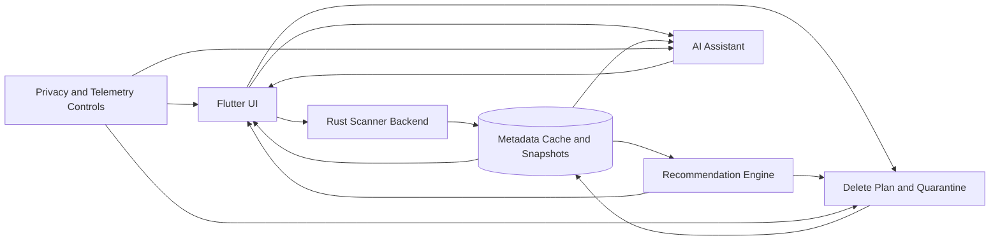

# Clean Disk и рынок кроссплатформенных анализаторов диска

Last updated: 2026-06-07.

This document preserves an external deep-research report saved from
`/Users/belief/Downloads/deep-research-report-07.06.26`. Citation markers from
the source report are kept as original evidence markers.

## Executive summary

`clean_disk` попадает в реальную, но уже зрелую категорию: инструментов для анализа занятого места на диске много, причем почти на каждой платформе есть сильные incumbents. На Windows это прежде всего WinDirStat, WizTree, TreeSize и SpaceSniffer; на macOS — DaisyDisk и GrandPerspective; на Linux/Unix-подобных системах — Baobab, Filelight и QDirStat. При этом почти все лидеры либо привязаны к одной ОС, либо имеют довольно «старый» UX. Самый близкий open-source конкурент в нише «кроссплатформенный GUI + современный стек» — SquirrelDisk — сам признает нестабильность и проблемы с подписью бинарников. Отсюда главный вывод: пространство для нового продукта есть, но не для «еще одного сканера», а для связки **быстрый движок + действительно современный UI + безопасная очистка + объяснимые рекомендации**. citeturn25view0turn25view1turn25view3turn25view5turn25view6turn12view0turn42search0

Технически у `clean_disk` сильная заделка на будущее: универсальный Flutter workspace, раздельные слои, локальный cache, планируемый Rust daemon, replaceable scanner backends, web/remote read-only режим, история сканов и явно продуманные safety-boundaries для cleanup и рекомендаций. Но сейчас это скорее **architecture-first pre-product**: нативный сканер еще не подключен, Rust-интеграция не завершена, публичных релизов нет, а на странице репозитория не виден явный `LICENSE`. Это снижает шансы «залететь» за счет текущего состояния, но повышает шансы быстро вырасти в серьезный продукт, если зафиксировать MVP и не пытаться тащить всю будущую сложность в первый релиз. citeturn13view1turn13view2turn13view3turn13view5turn14view0turn14view1turn14view2

Самый сильный актив проекта — не GUI как таковой, а выбор базы: `parallel-disk-usage` уже публично показывает очень сильные результаты на Linux/Unix-подобных деревьях файлов и в опубликованных сравнениях стабильно опережает `gdu`, `ncdu`, `dua`, `dust` и `du` в большинстве «обычных» сценариев, хотя проигрывает при экстремально подробном выводе. Но здесь же и главный продуктовый риск: на Windows NTFS продукты вроде WizTree и TreeSize используют MFT-ориентированные fast paths, а DaisyDisk на macOS имеет APFS-специфические оптимизации. Значит, если `clean_disk` хочет быть «самым быстрым везде», одного общего backend на базе `pdu` будет недостаточно; если же цель — «лучший кроссплатформенный UX и safest cleanup assistant», шансы выглядят заметно лучше. citeturn29view0turn29view1turn29view2turn30view0turn30view1turn29view3turn25view1turn40view0turn25view3

## Что представляет собой Clean Disk сейчас

По открытому репозиторию видно, что `clean_disk` задуман не как thin wrapper над готовым CLI, а как полноценный продукт с долгой архитектурной траекторией. В README прямо зафиксировано, что публичные контракты должны сохранять будущую форму продукта: segmented snapshots, multiple scanner backends, daemon/helper execution, web/remote read-only mode, scan history, safe cleanup и versioned DTOs. Текущая реализация при этом сознательно сужена до MVP-идеи: single `pdu`-backed scan, lazy metadata и paginated queries. Текущий стек — Flutter 3.41.9, Melos workspace, Clean Architecture/Hexagonal ports & adapters, Drift cache, а UI должен идти через отдельный design system package. citeturn13view1turn13view2

Это очень сильная база для продукта, потому что она заранее учитывает почти все «дорогие» эволюционные направления, которые у конкурентов обычно появляются уже постфактум: replaceable backends, daemon/runtime split, cached snapshots, remote/read-only path и safety-процессы вокруг удаления. В `START_HERE.md` дополнительно закреплены архитектурные решения: один Rust daemon c bounded worker pool, HTTP для запросов, WebSocket для событий, отдельные `fs_usage_*` crates и принцип, что Flutter-клиент не должен тянуть на себя полный scan tree как product truth. Там же прямо прописаны будущие границы для AI/recommendation authority, metadata-first content boundary, DeletePlan, receipts, quarantine/undo и false-positive control для рекомендаций. Это очень зрелый задел именно для продукта, который хочет быть безопаснее типичного «cleaner». citeturn14view0turn14view1

Но слабые стороны тоже видны без натяжки. В README сказано, что native scanner intentionally not wired yet; в `START_HERE.md` отдельно отмечено, что Rust scanner integration is not implemented yet и `flutter_rust_bridge` пока не установлен. На странице GitHub видны отсутствие релизов и отсутствие публичного сайта/тегов/описания; поиск по репозиторию в доступном веб-представлении не находит `LICENSE`. Практически это означает: сейчас у проекта есть **сильная архитектура, но еще нет продукта, который можно дистрибутировать, тестировать на пользователях и агрессивно сравнивать с incumbents**. citeturn13view1turn13view3turn13view5turn14view0

Самый важный стратегический вывод отсюда такой: твоим реальным moat не станет «чистая архитектура» — пользователи ее не покупают. Moat может появиться, если архитектура быстро материализуется в несколько очень заметных внешних свойств: **скорость, кроссплатформенность, понятные объяснения, безопасное удаление, история/сравнение сканов**. Иначе риск в том, что проект останется «очень правильно спроектированным, но недозапущенным продуктом». Этот риск особенно заметен на фоне SquirrelDisk, который уже публично позиционируется как кроссплатформенная open-source альтернатива и даже явно кредитует `parallel-disk-usage`. citeturn12view0turn14view0

## Карта конкурентов

Важное различие: **широкий рынок disk analyzers очень конкурентен**, но **прямых конкурентов в поднише “быстрый, современный, кроссплатформенный desktop app” существенно меньше**. Именно по этой причине главный battlefront для `clean_disk` — не WinDirStat как таковой, а связка из SquirrelDisk, DaisyDisk-подобного UX на macOS и WizTree/TreeSize-подобного ощущения мгновенности на Windows. citeturn12view0turn25view1turn25view3turn40view0

| Имя | Платформа(ы) | Лицензия/цена | Ключевые функции | UI/UX особенности | Поддержка ИИ/автоматических рекомендаций | Производительность/заметки | Ссылки |
|---|---|---|---|---|---|---|---|
| **SquirrelDisk** | Windows, macOS, Linux | AGPL-3.0, бесплатно | Быстрый скан, deep directory scanning, выбор диска или каталога, real-time detection внешних дисков, delete queue, открытие в explorer | Современный Tauri UI, sunburst chart, drag-and-drop queue | ИИ не заявлен | Самый близкий open-source peer для `clean_disk`; проект сам пишет, что не на 100% стабилен, а бинарники не подписаны; в credits упоминается `parallel-disk-usage` | сайт, GitHub citeturn10search2turn12view0 |
| **WinDirStat** | Windows | GPLv2, бесплатно | Анализ диска и cleanup assistant, сканирование дисков/папок, treemap, extension list | Классический tree + treemap интерфейс из традиции KDirStat | ИИ не заявлен | Очень узнаваемый open-source baseline на Windows; официальный сайт не заявляет filesystem-native fast path уровня MFT | сайт, downloads, background citeturn25view0turn38view2turn41view0 |
| **WizTree** | Windows | Бесплатно для personal use; commercial/supporter code для бизнеса | Очень быстрый анализ, treemap, advanced filters, duplicate detection, CSV export через CLI | Explorer-like list + treemap, ориентирован на speed-first workflow | ИИ не заявлен | На NTFS читает MFT напрямую; для fast MFT scanning в CLI/export нужен admin mode; есть улучшения скорости и для non-NTFS/network scan | сайт, guide, licensing citeturn25view1turn38view1turn39search1 |
| **TreeSize** | Windows | Free; Personal от 1.70 €/user/month; Professional от 3.40 €/user/month | Визуализация до file level, duplicates, поиск, compare over time, reports, scheduling, network/cloud/server scanning, bulk operations | Productivity/UI с упором на отчеты, фильтры и enterprise-сценарии | ИИ не заявлен | На local NTFS использует MFT; без MFT — 2 параллельных потока во Free и до 32 в Professional; позволяет browse results during scan; on-premise | editions, features, manual citeturn25view7turn25view8turn40view0turn40view1 |
| **DaisyDisk** | macOS | $9.99 one-time | Interactive circular map, hidden space discovery, QuickLook, multi-disk parallel scan, cloud disks, in-app deletion | Один из самых polished UX в категории; круговая карта + collector workflow | ИИ не заявлен | Официально публикует ориентиры скорости: APFS SSD startup disk 12–20 sec, HFS+ SSD 6–12 sec; отдельно поддерживает APFS snapshots/hidden space сценарии | App Store, specs, APFS post citeturn37view1turn25view3turn10search4 |
| **QDirStat** | Linux, BSD, Unix-like, macOS | GPLv2, бесплатно | Tree + treemap, multi-selection, user-defined cleanup actions, MIME/file-type views, histogram, file age, package manager support | Плотный power-user Qt UI; функционально богат, но не consumer-polished | ИИ не заявлен | Сильный cleanup toolbox для power users; менее «современный» визуально, чем Tauri/Flutter-конкуренты | GitHub/readme citeturn12view1 |
| **GNOME Disk Usage Analyzer** | GNOME/Linux | GPL-2.0, бесплатно | Скан папок, устройств и online accounts; tree + graphical view | Максимально простой GNOME-style UI | ИИ не заявлен | Хороший baseline для Linux desktop; сильнее как системный utility, чем как differentiated product | app page, repo citeturn25view5turn12view2 |
| **Filelight** | Linux, Windows | Бесплатно; open source, точная лицензия в найденном официальном сниппете не установлена | Визуализация через concentric rings, запуск скана по path, открытие файлов/папок | Очень узнаваемый ring/sunburst UX | ИИ не заявлен | Популярен как визуальный Linux/KDE baseline; больше про navigation/visualization, чем про safe cleanup workflow | app page, repo citeturn25view4turn43view0 |
| **GrandPerspective** | macOS | Open source GNU GPL; есть App Store публикация | Treemap visualization, поиск больших файлов/папок | Минималистичный lightweight treemap UX | ИИ не заявлен | Небольшая, понятная утилита; официальных абсолютных scan-time benchmark’ов не публикует | сайт, SourceForge/readme citeturn25view6turn42search0turn42search17 |
| **SpaceSniffer** | Windows | Freeware, portable | Понимание структуры папок/файлов на диске, portable workflow | Классический treemap/block-map UI | ИИ не заявлен | Старая, но до сих пор заметная freeware-утилита; официальные абсолютные бенчмарки в найденных источниках не установлены | official page / official-style listing citeturn10search9turn26view1 |

Если смотреть не только на «анализаторы», но и на соседний рынок **cleanup suites**, то там уже конкурируешь еще и с продуктами вроде CleanMyMac и встроенных средств ОС. Это важно, потому что пользователь часто покупает не «visual disk map», а **уверенность, что инструмент подскажет, что удалить безопасно**. Именно в этом слое у `clean_disk` есть шанс выделиться сильнее, чем просто еще одним treemap viewer. citeturn22search8turn23view9turn24view0

## Аналоги ИИ-ассистентов и safe-delete рекомендателей

Практически весь наблюдаемый рынок делится на две разные категории. Первая — **эвристические cleanup-assistants**, которые советуют удалить временные файлы, дубликаты, старые загрузки и т.п. Вторая — **LLM/RAG-assistants поверх файлов**, которые умеют объяснять содержимое, суммировать папки и отвечать по документам. Комбинация «локальный desktop disk scanner + действительно умный ассистент, который и объясняет, и безопасно рекомендует удаление» пока выглядит скорее как свободная ниша, чем как crowded segment. citeturn24view0turn23view7turn23view9turn23view5turn23view1turn23view3

| Имя/проект | Функционал | Используемые модели/технологии | Данные для обучения/приватность | Ограничения/риски | Ссылки |
|---|---|---|---|---|---|
| **Files by Google** | Персонализированные карточки для удаления unused apps, large files, duplicate files, downloaded files; еще в запуске Files Go Google отдельно говорила о low-resolution videos и memes | Mobile vision technology + эвристики; для duplicate files оригинал помечается бейджем `Original` | Политика использования данных именно для cleanup-card функций в найденных источниках не установлена | Удаление может быть permanent; даже дубликаты/мемы могут быть пользовательски ценными; мобильный сценарий не равен desktop cleanup | blog + help citeturn24view0turn24view1turn24view2turn24view3turn24view4turn24view5 |
| **CleanMyMac Assistant** | Рекомендует cleanup, optimization и security steps, напоминает о незавершенных действиях, объясняет tricky features | Не LLM; curated Safety Database и rule-based assistant | Вендор пишет, что Safety Database ведется с 2008 года и агрегирует опыт миллионов пользователей; публичных сведений о model training для этой функции нет | Риск false positive ниже, чем у «агрессивных чистильщиков», но остается зависимость от vendor-curated правил; ассистент может подталкивать к «лишней» очистке | assistant + safety DB + product page citeturn23view7turn23view8turn22search8 |
| **Windows Storage Sense** | Автоматически освобождает место за счет temporary files, Recycle Bin и некоторых cloud/offline items | Не ИИ; системные эвристики ОС | Локальная функция Windows; модельное обучение не применимо | Низкий риск по сравнению с third-party cleaners, но возможны UX-ошибки ожиданий: пользователь может рассчитывать, что корзина/офлайн-файлы сохранятся дольше | Microsoft Support / Learn citeturn23view9turn22search5 |
| **Dropbox Dash** | Universal search, AI chat по файлам и connected apps, summaries, Q&A, image interaction, выбор модели пользователем | Индексация подключенных источников + AI chat; exact model list в найденных публичных docs не установлен, но UI позволяет выбирать модель | Dropbox отдельно пишет про source sync / index / ingestion controls; для некоторых generative features, включая Stacks, данные не используются для обучения внутренних моделей третьих сторон и удаляются с third-party servers в течение 30 дней | Риски: избыточная индексация, access-control leakage, неполное grounding по неиндексированным данным; приватность зависит от настройки connectors и доступов | product/security/help citeturn16search0turn23view2turn23view1turn23view0turn18search7turn18search16 |
| **Gemini in Google Drive** | Summaries и Q&A по файлам и папкам; умеет работать с Docs/Sheets/Slides, PDF, video, image; есть folder-level prompts | Gemini in Workspace; точная модель/версия для этой функции в help-центре не установлена | Google пишет, что Workspace data не используется для обучения/улучшения underlying generative AI outside Workspace without permission | Явное ограничение: ответ может не включать каждый файл в папке; анализируется только одна папка за раз; возможны неполные выводы | Drive Help + Workspace privacy citeturn23view5turn23view6turn16search15turn16search16 |
| **Box AI** | Summaries, Q&A по документам, multi-source queries через AI Home, Notes/Hubs; enterprise content AI workflows | Multi-vendor stack: OpenAI, Anthropic, Google; Box также документирует embeddings и chunking-based processing | Box прямо заявляет, что данные не обучают underlying models без explicit permission; соблюдаются user permissions и enterprise policies | Основные риски — governance и grounding quality в enterprise-среде, а не «случайное автономное удаление»; решения надо проектировать permission-aware | Box support + dev docs citeturn15search1turn17search0turn23view3turn23view4turn17search6turn17search14 |

Из этой карты следует важный продуктовый вывод. **То, что реально удаляет, почти всегда работает на heuristics/rules**, а **то, что реально объясняет документы и файлы, почти всегда работает через SaaS LLM/RAG**. Поэтому для `clean_disk` наилучший путь — не «дать LLM право удалять», а построить двухконтурную систему: rule engine формирует safe candidates, а AI-слой **объясняет, ранжирует и предупреждает**, не получая прямой delete authority. Это очень хорошо совпадает с тем, что уже зафиксировано в твоем репозитории: AI/recommendation authority boundaries, recommendation policy и metadata-first content boundary. citeturn14view0turn24view0turn23view7turn23view9turn23view1turn23view5turn23view3

## Бенчмарки движка и как их правильно ставить

Публичный benchmark `parallel-disk-usage` полезен, но им нельзя ограничиваться. В workflow проекта прямо сказано, что benchmark нужно гонять в quiet environment; он выполняется на `ubuntu-latest`, использует `hyperfine`, а в качестве sample tree скачивает и распаковывает исходники Linux `v5.12` в `tmp.sample`. То есть опубликованные цифры хорошо показывают **скорость обхода и агрегации на metadata-rich POSIX tree**, но почти ничего не говорят о реальном поведении на NTFS system drive, APFS startup disk, огромных photo/video архивах, deeply nested trees, NAS/SMB или sandbox/permission-heavy сценариях. citeturn31view0turn31view1turn31view3turn32view2

Уже опубликованные результаты, однако, важны. На сценарии `--no-sort --max-depth=1` `pdu` показывает `82.7 ms`, тогда как `gdu` — `168.8 ms`, `ncdu` — `205.4 ms`, `du` — `192.9 ms`, `dua` — `231.8 ms`. На `block-size` `pdu` — `88.2 ms`, против `dust` с `110.9 ms`, `gdu` с `168.4 ms` и `ncdu` с `205.7 ms`. На `apparent-size` `pdu` — `88.7 ms`, снова опережая `dust`, `gdu`, `ncdu`, `du` и `dua`. Даже с включенным progress `pdu` (`104.8 ms`) остается впереди `gdu` (`178.6 ms`) и `ncdu` (`204.1 ms`). Но есть и честное слабое место: в сценарии `--min-ratio=0`, то есть при экстремально подробном выводе, `pdu` (`342.1 ms`) заметно уступает `du` (`195.0 ms`) и `ncdu` (`204.6 ms`). Это важный сигнал: твой движок очень силен именно как **быстрый scanner/aggregator**, но не автоматически лидер во всех режимах визуализации и подробного рендеринга. citeturn30view0turn29view1turn29view0turn30view1turn29view3

Есть и полезная cross-check из внешнего первичного источника: в README `gdu` включен собственный benchmark, где на домашнем каталоге `pdu` тоже оказывается быстрее `gdu` (`299.1 ms` против `466.1 ms`) и сильно быстрее `ncdu` (`2222.4 ms`), хотя там лидирует другой инструмент — `diskus`. Это не делает результаты универсальными, но подтверждает, что `pdu` действительно находится в верхнем эшелоне open-source recursive scanners на POSIX-like workloads. citeturn46search1

Ниже — то, что я бы тестировал как **обязательный benchmark suite** для `clean_disk`, если цель — не просто «быстро на моем ноутбуке», а воспроизводимое позиционирование против конкурентов.

| Метрика | Что именно мерить | Почему это важно |
|---|---|---|
| **Полное время сканирования** | wall-clock от старта до готового дерева/таблицы | Базовая пользовательская метрика «сколько я жду» |
| **Time-to-first-insight** | время до появления первых top folders/files | Для modern UI часто важнее полного завершения |
| **Files/sec и dirs/sec** | throughput на одинаковом дереве | Позволяет сравнивать scanner core независимо от UI |
| **Peak RAM** | peak RSS / private working set | GUI-приложение может быть «быстрым», но неприемлемо тяжелым |
| **CPU** | average/peak total CPU, user/sys split | Важно для ноутбуков, background scan и perceived responsiveness |
| **I/O** | bytes read, read IOPS, queue depth, cache hit/miss индикаторы | Показывает, кто реально читает FS эффективно, а кто просто «жрет диск» |
| **UI responsiveness** | FPS/scroll latency/search latency при активном скане | У modern UI это ключевой критерий качества |
| **Correctness** | hardlinks, symlinks, mount points, ADS, permission-denied, snapshots | Ошибки в учете размера и неправильные totals разрушают доверие |
| **Cancel/abort latency** | время от нажатия Cancel до фактической остановки | Особенно важно для deep scan и медленных сетевых томов |
| **Scalability** | рост времени/памяти на 100k, 1M, 10M файлов | Позволяет отделить «быстро на demo» от «масштабируется на реальном хламе» |

Набор тестовых сценариев я бы строил не вокруг «одного большого диска», а вокруг **разных типов деревьев**. Минимальный корпус стоит разделить на: **metadata-heavy** (Linux kernel, monorepo, `node_modules`, package caches), **large-file-heavy** (raw video, VM images, backups), **deep tree** (очень большая глубина), **wide tree** (сотни тысяч siblings), **hardlinks/symlinks**, **permission-restricted directories**, **cloud-sync folders** (Dropbox/Google Drive/OneDrive), **network share**, **external exFAT/NTFS disks** и **system-specific edge cases** вроде APFS snapshots и Windows ADS. По размеру я бы целился как минимум в три класса: около `100k` файлов и `10–50 GB`, около `1M` файлов и `100–500 GB`, и «stress» класс в районе `5–20M` файлов и `1–8 TB` суммарного пространства, даже если часть данных будет synthetic. Это позволит отделить UI/algorithm overhead от чисто файловой специфики. 

Для CLI/TUI части benchmark harness логично повторить идею upstream `pdu`: использовать `hyperfine` для wall-clock плюс отдельный сбор ресурсов через `/usr/bin/time -v`, `pidstat` и `iostat` на Linux/macOS. Базовые сравнения по POSIX-стеку можно начинать так:

```bash
hyperfine --warmup 3 \
  'pdu --no-sort --max-depth=1 /mnt/bench' \
  'gdu --non-interactive --no-progress /mnt/bench' \
  'ncdu -o /dev/null -0 /mnt/bench' \
  'du --count-links --summarize /mnt/bench'
```

```bash
hyperfine --warmup 3 \
  'pdu --quantity=apparent-size /mnt/bench' \
  'gdu --show-apparent-size --non-interactive --no-progress /mnt/bench' \
  'ncdu -o /dev/stdout -0 /mnt/bench' \
  'du --count-links --apparent-size /mnt/bench'
```

```bash
/usr/bin/time -v pdu --no-sort --max-depth=1 /mnt/bench >/dev/null
```

Эти команды отражают как минимум те же режимы, которые уже публикует сам `pdu` в своем benchmark suite. citeturn29view0turn29view1turn30view0turn30view1turn31view1

На Windows methodology должна быть двухслойной. Там есть смысл **разделить benchmark scanner core и benchmark продукта как GUI**. Для scanner-friendly сравнения у WizTree есть официальный CSV export через CLI, причем `admin mode` влияет на возможность fast MFT scanning. У TreeSize Professional есть официальные command line options для scheduled scans. Значит, для автоматизируемого comparison harness первым делом стоит использовать именно эти интерфейсы, а не пытаться «тыкать мышкой» во все подряд. Для WinDirStat и SpaceSniffer, где воспроизводимый headless/CLI workflow слабее или неочевиден, уже имеет смысл подключать UI automation (PowerShell + UIA/WinAppDriver/AutoHotkey) и мерить время до стабильного состояния окна, заполненного дерева и treemap, плюс потребление RAM/CPU через PerfMon. citeturn38view1turn28search2turn25view1

На macOS я бы тестировал отдельно **scan-time** и **cleanup-time**. DaisyDisk публикует официальные диапазоны скорости и отдельно документирует admin scanning / hidden space / APFS snapshots. Это означает, что честное сравнение с DaisyDisk требует не только одинакового каталога, но и одинаковых permission modes, одинакового учета скрытого системного пространства и четкой фиксации: «мы сравниваем обычный user-scan» или «мы сравниваем максимально полный scan». Без этого цифры будут нечестны. citeturn25view3turn10search4turn28search7

Если свести все в практический «ожидаемый эталон», я бы интерпретировал рынок так. **На NTFS system drives** лидерами по raw scan speed почти наверняка будут WizTree и TreeSize, потому что они используют MFT-ориентированные fast paths; обычный recursive scanner на базе `pdu` без Windows-specific backend, вероятно, не догонит их именно на этом классе задач. **На POSIX metadata-heavy trees** `pdu` уже сейчас выглядит как один из лидеров open-source стека. **На macOS startup/APFS disks** DaisyDisk остается эталоном UX и опубликованной скорости. **На remote/SSH сценариях** `ncdu` по-прежнему очень силен, потому что для этого и проектировался. Это не значит, что `clean_disk` не может выиграть рынок; это значит, что его win-condition — не «быть самым быстрым буквально в каждом filesystem-native случае», а **быть лучшим продуктом по совокупности скорости, UX и safe-cleanup experience**. citeturn25view1turn40view0turn29view0turn29view1turn30view0turn46search1turn25view3turn46search0

## Рыночный потенциал и шансы залететь

Категория disk analyzers — это не пустой рынок, а скорее **устойчивая utility-ниша**. По pricing и positioning это хорошо видно: DaisyDisk продается как one-time utility за `$9.99`, TreeSize имеет free tier и платные редакции вплоть до IT/admin use cases, а WizTree бесплатен для personal use, но монетизируется supporter/commercial licensing. То есть пользователи готовы платить — но обычно **не за базовую функцию “покажи, что занимает место”**, а за скорость, удобство, enterprise-функции или очень polished experience. citeturn37view1turn25view7turn39search0turn39search1

Это сразу снижает потенциал широкого consumer market для еще одного «анализатора ради анализатора». У массового пользователя уже есть встроенные аналоги рекомендаций по очистке: Files by Google на Android и Storage Sense на Windows. А у Mac-пользователя уже есть очень сильный и узнаваемый DaisyDisk. Поэтому попытка атаковать рынок лозунгом «мы тоже умеем показать большие папки» почти наверняка упрется в низкую конверсию. citeturn24view0turn23view9turn37view1

Где потенциал выше — это три подрынка. Первый: **developers и power users**, которым нужен быстрый кроссплатформенный treemap/table tool с человеческим UI; здесь конкуренты есть, но прямой современный кроссплатформенный GUI-эталон почти не закрепился. Второй: **privacy-first users**, которым не хочется грузить структуру файлов в облако ради объяснений, но хочется понимать, что безопасно удалить. Третий: **small-team / IT / support scenarios**, где полезны история сканов, diff, экспорт, remote read-only mode и audit trail. И вот как раз эти направления уже хорошо согласуются с твоими архитектурными решениями в репозитории. citeturn12view0turn14view0turn25view8turn17search14turn23view6

Если говорить честно про «шансы залететь», то я бы оценивал их так. Как **generic consumer cleaner** — шансы скорее умеренные или ниже средних, потому что рынок там crowded и partly commoditized встроенными решениями. Как **open-source darling для GitHub / Hacker News / power users** — шансы хорошие, если быстро показать benchmarkable speed, polished desktop UX и внятную safety-story. Как **платный pro utility** — шансы тоже неплохие, если добавить diff/history, delete receipts/quarantine, explainable recommendations и потом дойти до remote/fleet use cases. Самый реалистичный путь к «залететь» — это не копировать Tier-1 incumbents по одному параметру, а объединить то, что они обычно держат раздельно: **современный UI, privacy-first local processing, safe deletion workflow и объяснимые рекомендации**. citeturn12view0turn25view7turn37view1turn39search0turn23view9turn24view0turn14view0

## Рекомендации по дифференциации, MVP и архитектуре

Ниже — архитектура, которая лучше всего соответствует и текущему репозиторию, и реальному конкурентному ландшафту. Она исходит из простого правила: **scanner считает и агрегирует**, **metadata DB кэширует и готовит evidence**, **AI-слой объясняет и ранжирует**, а **delete-модуль выполняет только receipt-backed и reversible операции**. Это прямо соответствует уже заложенным у тебя boundaries вокруг daemon/runtime split, snapshots, policy objects, operation journal, receipts и AI authority limits. citeturn13view1turn14view0turn14view1



Самая сильная продуктовая ставка для MVP — сделать **не “диск-анализатор”, а “safe space reclamation cockpit”**. В MVP я бы включил только то, что напрямую повышает perceived value: быстрый scan и time-to-first-insight; tree/table + treemap/sunburst; top files / top folders / filters / search; delete queue; quarantine/undo/receipts; базовый explainability layer для рекомендаций; сравнение «до/после». Все остальное — full LLM assistant, cloud connectors, remote/headless orchestration, multi-client sessions, rich automation — стоит оставить за пределами первого релиза, даже если архитектура их уже предполагает. Иначе сложность просто съест скорость выхода. citeturn14view0turn13view1

Ключевая дифференциация должна быть не в том, чтобы «самостоятельно удалять мусор», а в том, чтобы **показывать доказательства**. Хороший recommendation card для `clean_disk` должен отвечать минимум на пять вопросов: что это; почему оно попало в рекомендацию; насколько уверена система; какой риск удаления; как откатить действие. Здесь можно и нужно сочетать rule-based слой и AI-слой. Rule engine может уверенно находить safe categories вроде временных артефактов, старых загрузок, duplicate candidates, caches, stale build artifacts. AI же должен объяснять: «это папка X, не открывалась Y дней, состоит из Z файлов, похожа на build output по шаблону A/B/C, удаление освободит N GB, восстановление возможно из quarantine». То есть модель — **советник и интерпретатор, но не субъект удаления**. Этот подход лучше всего снимает оба главных риска: ложные удаления и утечки приватных данных. citeturn24view0turn23view7turn23view9turn23view5turn23view3turn14view0

По backend strategy я бы не ограничивался одним scanner path. Твой репозиторий уже допускает multiple scanner backends, и это нужно использовать максимально прагматично. Для POSIX/general recursion — `pdu`-style backend. Для Windows NTFS — отдельный backend или fast path, который целится в MFT-class performance, иначе сравнение с WizTree/TreeSize будет проигрышным с порога. Для macOS — отдельный APFS-aware слой для hidden space, snapshots и permission-sensitive scan modes, иначе ты никогда не догонишь DaisyDisk по «ощущению правды» о занятом месте. Это именно тот случай, где архитектурная гибкость может стать не абстрактной красотой, а прямым конкурентным преимуществом. citeturn13view1turn14view0turn25view1turn40view0turn25view3turn10search4

С UX-стороны я бы рекомендовал четыре идеи. Первая — **progressive disclosure**: быстрый high-level answer сразу, деталь — по мере догрузки. Вторая — **risk-first cleanup UX**: рядом с размером всегда показывать риск и обратимость. Третья — **compare mode**: «что выросло с прошлого скана» часто полезнее, чем просто «что большое сейчас» — здесь TreeSize уже подтверждает рыночную ценность compare-over-time. Четвертая — **explainability drawer**: пользователь кликает на рекомендацию и видит не только path, но и human-readable rationale. Именно этот слой сильнее всего отличит `clean_disk` от большинства treemap-конкурентов. citeturn25view8turn14view0

По монетизации наиболее реалистичны три модели. Первая — **open-source core + paid binaries/supporter code**, ближе к WizTree. Вторая — **consumer polished app c one-time pricing**, ближе к DaisyDisk. Третья — **Free/Pro split**, где Pro дает compare/history, advanced reports, scheduling, remote read-only, organization-level scan indexes и policy packs — ближе к TreeSize. Для твоего проекта наиболее правдоподобной мне кажется гибридная схема: permissive open backend/evidence layer, бесплатный базовый desktop app, а платный Pro — за diff/history, advanced cleanup policy packs, signed binaries, team/remote features и premium explainability. Это позволит и получить community traction, и не убить коммерческий потенциал. При этом вопрос лицензии надо решить рано: в текущем репозитории явная лицензия на странице не видна, а это ухудшает и вклад сообщества, и будущие коммерческие переговоры. citeturn39search0turn37view1turn25view7turn13view5

## Ключевые источники

Для самого проекта: репозиторий `clean_disk`, README, `START_HERE.md` и workspace-файлы с описанием будущих backends, daemon/runtime split, safe cleanup, AI/recommendation boundaries и текущего статуса интеграции. citeturn13view1turn14view0turn14view1turn14view2

Для движка и benchmark-части: `parallel-disk-usage` GitHub/crates.io, публичные benchmark artifacts для `0.20.0`, workflow CI с `hyperfine` и sample tree на Linux `v5.12`, плюс независимый benchmark-срез из README `gdu`. citeturn36search0turn29view0turn29view1turn29view2turn29view3turn30view0turn30view1turn31view0turn31view1turn31view3turn46search1

Для конкурентной карты: официальные сайты и репозитории SquirrelDisk, WinDirStat, WizTree, TreeSize, DaisyDisk, QDirStat, GNOME Disk Usage Analyzer, Filelight и GrandPerspective; для SpaceSniffer — официальная страница Uderzo и актуальная официальная x64 listing. citeturn12view0turn25view0turn25view1turn25view7turn25view8turn25view3turn12view1turn25view5turn25view4turn25view6turn10search9turn26view1

Для слоя «ассистентов»: официальные материалы Files by Google, CleanMyMac, Windows Storage Sense, Dropbox Dash, Gemini in Drive и Box AI — именно они лучше всего показывают, как рынок сегодня разделяет safe-delete heuristics и file-explainer AI. citeturn24view0turn24view1turn24view2turn23view7turn23view8turn23view9turn23view1turn23view2turn23view5turn23view6turn23view3turn23view4
